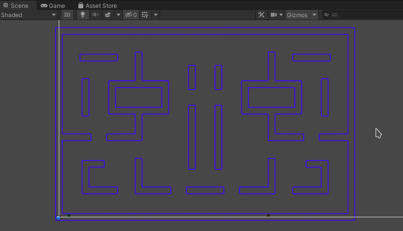

# PacMan40th
40th anniversary pacman in unity 2019



# PacMan 40th anniversary

## INFO

- local directory: ~/DATA/E/UNITY.PROJECTS/2020-1-PACMAN/PacMan40th/
- PSD directory: ~/DATA/E/UNITY.PROJECTS/2020-1-PACMAN/PacMan40th/img

## TODO

- pulizia del codice
- verifica sezioni chiuse del labirinto
- implementazione del player - add component script PlayerController. 
ogni frame va verificato se è stato premuto un tasto. 
si posiziona il gameobj del player a 1,1 e verificare dimensione con if in update 
+ component: rigidbody 2d collider
in base a come è girato continua, con i tasti si cambia direzione e si sposta di una certa velocità (inspector), si incrementa 
- occhiata all'algoritmo di movimento dei fantasmi

- trello ? 
- seed for random
- test collider con player
- fix della topologia del labirinto (no vicoli ciechi e simmetria sull'asse verticale/orizz)
- implement. dei tunnel
- ghosts

## CODE

- building the maze:
```
	StartNewMaze() of GameController.cs
	FromDimensions(int sizeRows, int sizeCols)of MazeDataGenerator.cs
	DisplayMaze() of MazeConstructor.cs
```
- rendering the maze:
```
    RenderFromData(int[,] data) of MazeRenderer.cs
```

## PATHs & URLS

* [PacMan 40th anniversary git](git@github.com:masayume/PacMan40th.git)
* [PacMan 40th anniversary URL](https://github.com/masayume/PacMan40th)
* []()
* []()
* []()
* []()
* []()


## DONE
- gestione della simmetria centrale
- fix del layout del labirinto alla pacman
- pacman sprite placeholder
