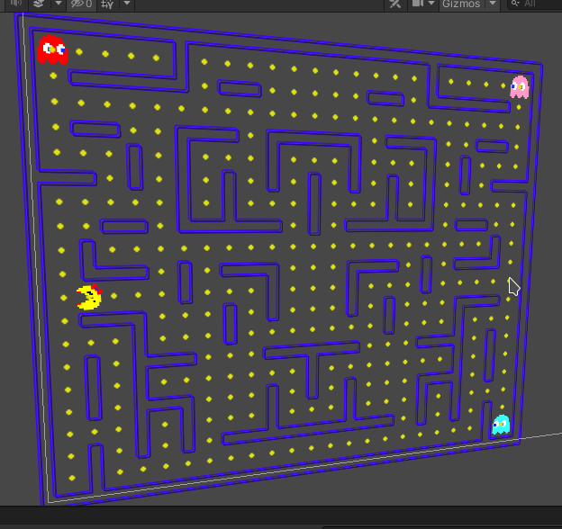

# PacMan40th
40th anniversary pacman in unity 2019



# PacMan 40th anniversary

## INFO

- local directory: ~/DATA/E/UNITY.PROJECTS/2020-1-PACMAN/PacMan40th/
- PSD directory: ~/DATA/E/UNITY.PROJECTS/2020-1-PACMAN/PacMan40th/img

## TODO
- switch ghostState every n seconds (scatter/chase) update ghost targets
- switching ghost state invert movement
- ghosts bump (?)
- refactor ghost states to ENUM
- verifica sezioni chiuse del labirinto (loops in undirected graph of adjacent tied wall elements)
	https://www.geeksforgeeks.org/detect-cycle-undirected-graph/
- pacman shader
- ghost shader
- sound samples
- maze shader
- dots shader
- menu scene
- trello ? 
- seed for random
- test collider con player
- fix della topologia del labirinto (no vicoli ciechi e simmetria sull'asse verticale/orizz)
- implement. dei tunnel
- ghosts

## CODE

- building the maze:
```
	StartNewMaze() of GameController.cs
	FromDimensions(int sizeRows, int sizeCols)of MazeDataGenerator.cs
	DisplayMaze() of MazeConstructor.cs
```
- rendering the maze:
```
    RenderFromData(int[,] data) of MazeRenderer.cs
```

## PATHs & URLS

* [PacMan 40th anniversary git](git@github.com:masayume/PacMan40th.git)
* [PacMan 40th anniversary URL](https://github.com/masayume/PacMan40th)
* [PacMan Ghost AI explained](https://www.youtube.com/watch?v=ataGotQ7ir8)
* [PacMan postmortem](https://www.masayume.it/blog/content/pac-man-postmortem-e-co)
* [PacMan Dossier](https://github.com/floooh/pacman.c/blob/main/pacman-dossier.pdf)
* [2D PacMan Game @ noobtuts](http://noobtuts.com/unity/2d-pacman-game)
* [Procedural Generation Of Mazes With Unity](https://www.raywenderlich.com/82-procedural-generation-of-mazes-with-unity)
* []()


## DONE
- algoritmo di movimento dei fantasmi (GhostController)
- animazioni dei fantasmi
- gestione della simmetria centrale
- fix del layout del labirinto alla pacman
- pacman sprite placeholder
- pulizia del codice
- implementazione del player - add component script PacmanMove (PlayerController). 
- dot prefab
- populate "Dots" with PacDot prefabs for any floor + any space between floor 
- dots collision
- show score and increment when a dot is eaten
- verifica dello spazio delle coordinate di pacman e dei punti (dot)
