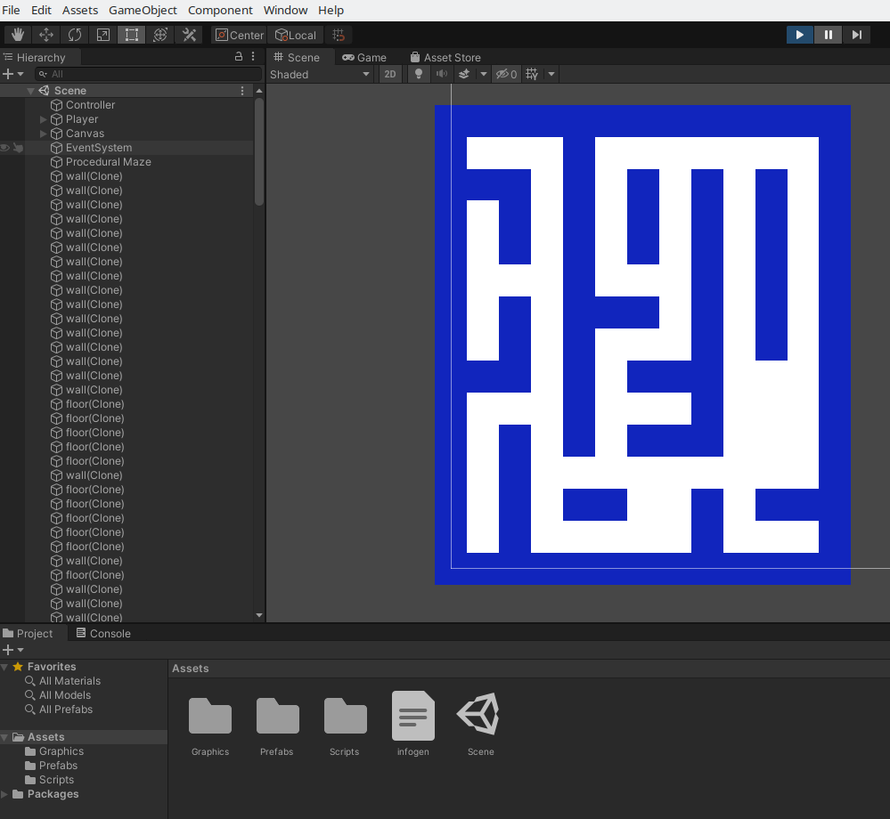

# PacMan40th
40th anniversary pacman in unity 2019

# PacMan 40th anniversary

## TODO

- trello ?
 
- upload su git e share a luca

- posizionamento wall/floor (pivot centrale)

- test collider con player

- fix del layout del labirinto alla pacman

- fix della topologia del labirinto (no vicoli ciechi e simmetria sull'asse verticale/orizz)

- implement. dei tunnel

## CODE

- building the maze:
	FromDimensions(int sizeRows, int sizeCols)of MazeDataGenerator.cs
	DisplayMaze() of MazeConstructor.cs

- rendering the maze:
     RenderFromData(int[,] data) of MazeRenderer.cs

## PATHs & URLS

* [PacMan 40th anniversary git](git@github.com:masayume/PacMan40th.git)
* [PacMan 40th anniversary URL](https://github.com/masayume/PacMan40th)
* 
* 
* 
* 
* 

